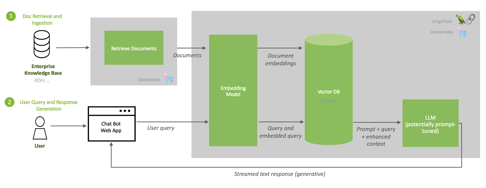

# NVIDIA AI Workbench: Introduction
This is an [NVIDIA AI Workbench](https://developer.nvidia.com/blog/develop-and-deploy-scalable-generative-ai-models-seamlessly-with-nvidia-ai-workbench/) example project that provides a simple way to converse with documents of your choice using a chatbot and a developer Retrieval Augmented Generation (RAG) workflow with the ability to run on different Large Language models and different hardware. Users in the [AI Workbench Beta Program](https://developer.nvidia.com/ai-workbench-beta) can get up and running with this Project in minutes. 

Have questions? Please direct any issues, fixes, suggestions, and discussion on this project to the DevZone Members Only Forum thread [here](https://forums.developer.nvidia.com/t/support-workbench-example-project-local-rag/278378). 

## Description 
Retrieval Augmented Generation, or RAG, is a recent breakthrough in Large Language Modeling that augments model output through the integration of external sources of knowledge stored and queried as embeddings in a Vector Database. Existing LLMs face a variety of issues that may limit feasibility in an enterprise, such as outdated data, lack of real-time knowledge, and poor domain specificity; RAG addresses these limitations by providing flexibility for the user to provide documents to the LLM of the user's choice to better reflect updated or real-time data and improved domain context, which results in greater accuracy and responsiveness of developing and deploying LLMs in an enterprise setting. 



Above is an example of a RAG workflow. When the user submits a query to an LLM augmented with stored documents in a Vector Database, their query is first converted to an embedding via an embeddings model. This embedding is then queried to the Vector Database, matched with the corresponding document embeddings stored there, and the most relevant documents are extracted. The LLM then uses this prompt and extracted documents as context to formulate a natural language response to send back to the user, improving accuracy and specificity in the model output. 

Developers can use this project as a reference to develop their own RAG workflow, build their own custom langchain connectors, or extend the existing implementation to address enterprise use cases of their choice. AI Workbench makes this development and testing process easy! 

## System Requirements:
* Operating System: Linux, Windows WSL, or Mac; tested on Ubuntu 20.04
* CPU requirements: None, tested with Intel&reg; Xeon&reg; Platinum 8380 CPU @ 2.30GHz
* GPU requirements: Any NVIDIA training GPU, tested with NVIDIA A100-80GB
* NVIDIA driver requirements: Latest driver version
* Storage requirements: 40GB

# Prerequisites
You will need to have your Hugging Face API Key ready - since certain models we plan to use in this project are gated, ensure your API key has access to them, eg. Llama 2. To apply for access, submit a request on [Meta's portal](https://ai.meta.com/resources/models-and-libraries/llama-downloads/) for permission to use to all models in the Llama family. Please note that your HuggingFace account email address MUST match the email you provide on the Meta website, or your request will not be approved. Upon starting any application in this project for the first time, you may be prompted to provide this API key to the project, which will be used to pull models from Hugging Face to your project. 

# Quickstart

## Step 1: Setup the Project
If you have NVIDIA AI Workbench already installed, you can open this Project in AI Workbench on your choice of machine by:

### On Desktop
Fork this Project to your own Github namespace and copy the clone link. Open the Desktop app and select your location of choice. Select "Clone Project" and enter the clone link. Wait for the build to complete. 

### On CLI
Get started in the CLI by: 

1. Forking this Project to your own GitHub namespace and copying the clone link

   ```
   https://github.com/[your_namespace]/<project_name>.git
   ```
   
3. Opening a shell and activating the Context you want to clone into by

   ```
   $ nvwb list contexts
   
   $ nvwb activate <desired_context>
   ```
   
4. Cloning this Project onto your desired machine by running

   ```
   $ nvwb clone project <your_project_url>
   ```
   
5. Opening the Project by

   ```
   $ nvwb list projects
   
   $ nvwb open <project_name>
   ```

---
**Tip:** Use ```nvwb help``` to see a full list of NVIDIA AI Workbench commands. 

---

## Step 2: Configure and Explore
After cloning this project, the next step is to configure the project. This involves setting environment variables based on your setup and configuring secrets in AI Workbench.

### On Desktop
First set environment variables in the "Environment" tab for the project in AI Workbench. By default the project is configured for local inference on a system with 1 GPU(s) with at least 80GB of VRAM (e.g. A100-80GB), but can be customized for your particular hardware setup. Review the [Configuration Details](#configuration-details) section below for more tips on how to configure for your particular system.

After setting the appropriate environment variables you must set up secrets to access models, if not set up already. Keep in mind, you must set the `HUGGING_FACE_HUB_TOKEN` secret to a valid Hugging Face API Token. You must have access to the Llama2 model in Hugging Face by requesting it here: [https://huggingface.co/meta-llama/Llama-2-7b-chat-hf](https://huggingface.co/meta-llama/Llama-2-7b-chat-hf).

Finally, start the `jupyterlab` app and then run the `code/01-Setup.ipynb` notebook to verify your configuration and download the model if needed. You may also develop and write your own custom code inside the jupyterlab environment. 

### On CLI
Alternatively if working in CLI, open the ```variables.env``` file using your filesystem and edit the environment variables directly inside the file. Save your changes. Review the [Configuration Details](#configuration-details) section below for more tips on how to configure for your particular system.

Then, start the jupyterlab application using 

   ```
   $ nvwb start jupyterlab
   ```

You may be prompted to supply your Hugging Face API key. Keep in mind, you must set the `HUGGING_FACE_HUB_TOKEN` secret to a valid Hugging Face API Token. You must have access to the Llama2 model in Hugging Face by requesting it here: [https://huggingface.co/meta-llama/Llama-2-7b-chat-hf](https://huggingface.co/meta-llama/Llama-2-7b-chat-hf).

When finished, navigate to the ```code``` directory and run the `code/01-Setup.ipynb` notebook to verify your configuration and download the model if needed. You may also develop and write your own custom code inside the jupyterlab environment. 

## Step 3: Start the RAG Server and Vector Store
Once you are done developing within the project, you can start the rag server and vector database by running in the CLI:
   
   ```
   $ nvwb start rag-server
   ```

On Desktop, simply run the `rag-server` application. This application may take a few moments to spin up properly. 

### Troubleshooting
This process starts up an API server, an inference server for local inference, and a Milvus vector database, which may take some time to spin up properly. Because of the way AI Workbench handles application timeouts, you may sometimes see an "Error Starting Rag-Server" message. In reality, the RAG server application may still be in the process of spinning up the Vector Database on the underlying container and may have timed out on the AI Workbench client. To resolve this, simply wait a few moments and press ``[CTRL] + r`` to refresh the application status. If all components are spun up properly, you will see the "Rag-server" spun up successfully. 

## Step 4: Index Documents
There are two ways to get documents into this project. The first is to drag and drop them into the `data/documents` directory in the project. These files will not be committed or synced and only indexed locally.

The second is to create Host Mounts in the "Environment" tab of the project in AI Workbench to folders on your computer that contain the documents you which to index. When creating mounts on the Desktop, set the target directory to `/mnt/docs/<FOLDER NAME>` where `<FOLDER NAME>` can whatever makes sense for the mount. Any subfolder in `/mnt/docs/` will get indexed. You may also run `nvwb create` and `nvwb configure` mounts in the CLI if working outside the desktop app. 

Finally, in Jupyterlab open `code/02-Load-Docs.ipynb` and run the notebook. This will load your documents into the vector database. Text files and pdfs work well.

## Step 5: Start the Chat UI
Once you are done uploading your data to the vectore store, you are ready to start chatting with your data. Start the Chat UI by running in the CLI:
   
   ```
   $ nvwb start chat
   ```

On Desktop, simply run the `chat` application.

## Step 6: Use the Chat app
You're all set! Now just use the chat app and chat with your data. Select the `Use knowledge base` checkbox when you want to have your data passed to the LLM as context and inform the response.

If you add more data or your files change, just rerun the `code/02-Load-Docs.ipynb` notebook. Files that have already been loaded will be skipped automatically. To clear the database entirely, run the `code/03-Reset.ipynb` notebook. 

# Configuration Details
Configuration is primarily done via Environment Variables, which can be easily set throught "Environment" tab for the project in AI Workbench. If working outside the Desktop, edit and save ``variables.env`` in your favorite text editor. 

Variables:
- `EMBEDDING_DEVICE`: (cpu | cuda:N) Device used to run embedding model for vector database. If using a GPU, it should always be set to the last index (`cpu`, `cuda:N`).
- `QUANTIZE`: (local) Method of quantization (`bitsandbytes-nf4`, `bitsandbytes`, None)
- `HUGGINGFACE_HUB_CACHE`: (local) Location where models downloaded from hugging face will be cached. Workbench automatically is using a volume to cache data for you. You should not need to change this.
- `MODEL_ID`: (local) The Hugging Face model ID used to download the model when running inference locally. Typically should be `meta-llama/Llama-2-7b-chat-hf` or `meta-llama/Llama-2-13b-chat-hf` depending on your hardware.

## Example Hardware Configurations
Here are a couple sample configurations of varying GPU VRAM to serve as a reference for your particular hardware configuration. 

### Dual RTX 3090
The RTX 3090 has 24GB of VRAM, so we can run the 7b model with quantization on 1 GPU and embeddings on the other.

- `INFERENCE_MODE`: local
- `EMBEDDING_DEVICE`: cuda:1
- `QUANTIZE`: bitsandbytes-nf4
- `MODEL_ID`: meta-llama/Llama-2-7b-chat-hf

### Single A100-80GB
The A100-80GB has 80GB of VRAM, so we can run the 7b model locally and embeddings on the cpu.

- `INFERENCE_MODE`: local
- `EMBEDDING_DEVICE`: cpu
- `QUANTIZE`: bitsandbytes-nf4
- `MODEL_ID`: meta-llama/Llama-2-7b-chat-hf

## Tested On
This notebook has been tested with an NVIDIA A100-80gb GPU and the following version of NVIDIA AI Workbench: ```nvwb 0.13.14 (stable; linux; amd64; go1.21.3; Wed Jan 10 20:09:13 UTC 2024)```

## License
This NVIDIA AI Workbench example project is under the [Apache 2.0 License](https://github.com/NVIDIA/workbench-example-local-rag/blob/main/LICENSE.txt)

This project will download and install additional third-party open source software projects. Review the license terms of these open source projects before use. Third party components used as part of this project are subject to their separate legal notices or terms that accompany the components. You are responsible for confirming compliance with third-party component license terms and requirements. 
